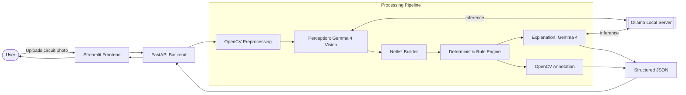

# CircuitSense

### A Multimodal, Local-First AI Assistant for Hardware & Breadboard Debugging

> **Hacktober Fest | Open Source AI Hackathon | Qualifier Submission — Organized by Elevate**
> *Powered by an open-weight vision-language model (Gemma 4), running fully on local hardware.*

---

## The Problem: Breadboard Debugging is a Nightmare

Anyone who has spent hours in an electronics lab knows the frustration: you wire up an Arduino, an L293D motor controller, or a basic digital logic circuit, flip the power, and nothing happens. 

Debugging physical electronics is slow and heavily dependent on experience. Visual wiring errors are incredibly easy to make and hard to spot. A jumper wire plugged one hole over, an LED inserted backwards, a missing current-limiting resistor, or a floating ground can take hours to find by eye. 

Circuit simulators (like Tinkercad) only check idealized schematics, not the physical board sitting on your desk. Generic AI chatbots can't reliably "see" a breadboard layout, and relying on cloud-vision APIs introduces latency, cost, and privacy concerns. Beginners and hobbyists often work alone, without a mentor or lab instructor to just look at their board and point out the obvious mistake before a component burns out.

There is a huge gap for an accessible, offline tool that takes a photo of a *real* circuit and gives a structured, explainable diagnosis.

## The Solution: CircuitSense

CircuitSense is a local-first, multimodal AI debugging system. You take a photo of your breadboard or PCB, optionally type in what the circuit is supposed to do, and the system points out the errors. 

Instead of just slapping a generic wrapper around an LLM, this project separates **perception** from **verification**. 
1. The AI (Gemma 4 Vision) is strictly used to "see" the board—identifying components, colors, and wire endpoints. 
2. That visual data is extracted into a strict, machine-readable JSON netlist. 
3. A deterministic Python rule engine runs hard checks on that netlist (e.g., checking for power-to-ground shorts, missing resistors, or reversed polarities). 
4. The AI is called one last time to translate those hard errors into a plain-language explanation for the user.

By letting the AI perceive and explain, but forcing standard code to do the actual safety verification, we eliminate hallucinations about circuit logic. 

## How It Works Under the Hood

The pipeline is designed to run entirely locally on a single machine (like a laptop with a decent GPU), ensuring users' project photos remain private and they don't rack up API bills. 

*   **Image Preprocessing (OpenCV):** Breadboard photos usually have terrible glare and shadows. The system resizes, denoises, and contrast-enhances the image before it hits the model.
*   **Visual Perception (Gemma 4 via Ollama):** The multimodal model analyzes the cleaned image to identify parts and where they connect, outputting the data into a constrained json schema.
*   **Netlist & Rule Engine (Python/Pydantic):** The JSON is mapped into a connectivity graph. Standard electronic rules are checked against it. If an LED's anode is wired directly to ground, the engine flags it.
*   **Explanation & UI (Gemma 4 & Streamlit):** The findings are sent back to Gemma to generate a user-friendly diagnosis. The frontend displays the explanation alongside the original image, with OpenCV drawing bounding boxes around the problem areas.

### System Architecture



## Tech Stack

*   **Core Intelligence:** Gemma 4 (multimodal/vision variant) for image understanding and text generation.
*   **Local Inference:** Ollama (with Hugging Face Transformers as a fallback).
*   **Backend:** FastAPI (Python) to orchestrate the pipeline and enforce Pydantic schemas.
*   **Frontend:** Streamlit or Gradio for a fast, interactive web UI.
*   **Computer Vision:** OpenCV, Pillow, and NumPy for image preprocessing and drawing annotation boxes.

## What to Expect for the Hackathon Demo

For the final hackathon build, the goal is a tight, working prototype rather than a tool that can diagnose every component on earth. 

The MVP will focus on correctly identifying 3 to 4 specific classes of faults on physical breadboards:
1.  Reversed LED polarity.
2.  Missing current-limiting resistors.
3.  Direct power-to-ground short circuits.
4.  Wires plugged into the wrong breadboard rail.

The output will be a side-by-side view: your uploaded image with the problem areas boxed, and a JSON-structured report detailing the diagnosis, specific issues, and concrete fixes.

```json
{
  "diagnosis": "the circuit will not light the led because of a reversed polarity and a missing series resistor.",
  "issues": [
    {
      "type": "led_reversed",
      "severity": "critical",
      "location": "row 12"
    }
  ],
  "fixes": [
    "flip the led so the longer leg faces the positive supply.",
    "insert a 220-330 ohm resistor in series with the led."
  ]
}
```

## Expected Challenges

Building a vision pipeline for dense hardware is tough. Breadboards are visually noisy, and models often struggle to map a wire endpoint to the exact millimeter of a breadboard hole. To handle this, the system will rely heavily on the OpenCV preprocessing step to clean the image, and the prompt engineering will force the model to look for relative rail connections rather than absolute pixel coordinates. If the model is completely unsure about a messy cluster of jumper wires, it is programmed to reject the image and ask the user for a clearer, zoomed-in photo rather than guessing and giving bad advice.

---
*Disclaimer: CircuitSense is an educational tool. It does not replace a multimeter and should never be used to verify safety-critical or high-voltage wiring.*