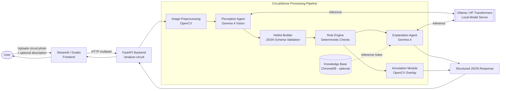
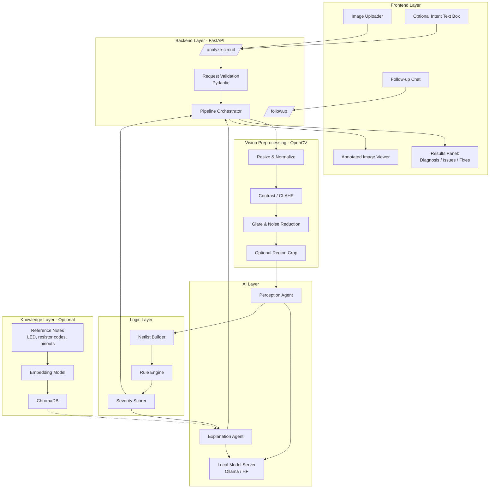
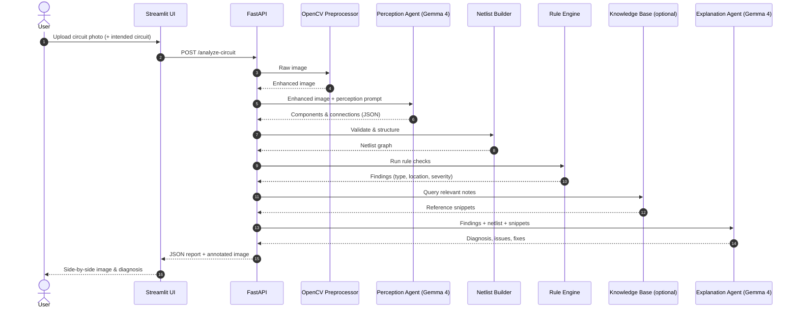
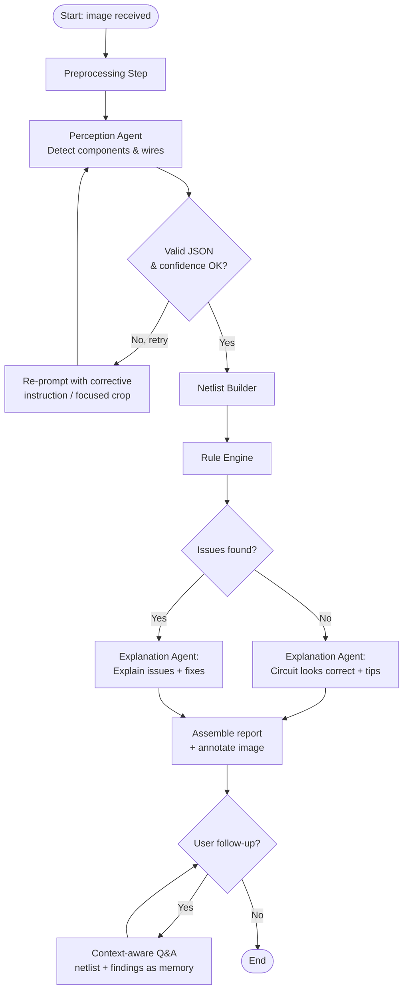

# CircuitSense

### A Multimodal, Local-First AI Assistant for Hardware & Breadboard Debugging

> *Hacktober Fest | Open Source AI Hackathon | Qualifier Submission — Organized by Elevate*
> *Powered by an open-weight vision-language model (Gemma 4), running fully on local hardware.*

---

## Table of Contents

1. [Project Name](#1-project-name)
2. [Problem Statement](#2-problem-statement)
3. [Project Overview](#3-project-overview)
4. [Proposed Solution](#4-proposed-solution)
5. [Objectives](#5-objectives)
6. [Target Users / Use Case](#6-target-users--use-case)
7. [Open-Source AI Technology Selected](#7-open-source-ai-technology-selected)
8. [Why This Technology Was Selected](#8-why-this-technology-was-selected)
9. [AI's Role in the System](#9-ais-role-in-the-system)
10. [System Architecture](#10-system-architecture)
11. [Component-Level Architecture](#11-component-level-architecture)
12. [Data / Information Flow](#12-data--information-flow)
13. [Agentic Workflow](#13-agentic-workflow)
14. [Technology Stack](#14-technology-stack)
15. [Expected Features](#15-expected-features)
16. [Implementation Approach](#16-implementation-approach)
17. [Expected Final Output](#17-expected-final-output)
18. [Future Scope / Scalability](#18-future-scope--scalability)
19. [Open-Source Dependencies / Components](#19-open-source-dependencies--components)
20. [Expected Challenges and Mitigation](#20-expected-challenges-and-mitigation)

---

## 1. Project Name

**CircuitSense** — *Multimodal Hardware & PCB Debugging Assistant*

**Tagline:** *Show it your circuit. It tells you what's wrong, why, and how to fix it.*

---

## 2. Problem Statement

Debugging electronics is slow, frustrating, and heavily dependent on experience.

- **Visual wiring errors are easy to make and hard to spot.** A jumper wire one hole off, an LED inserted backwards, a missing current-limiting resistor, or a floating ground can take hours to find by eye.
- **Beginners lack a mentor.** Students and hobbyists often work alone, without access to an experienced engineer who can look at their board and say "that wire is in the wrong rail."
- **Existing tools don't solve this.** Circuit simulators (e.g. Tinkercad, Falstad) only check *idealized schematics*, not the *physical* board in front of you. Search engines and forums need the user to already know what to describe. Generic chatbots cannot reliably "see" a breadboard, and cloud-only vision APIs raise cost, latency and privacy concerns.
- **Wrong wiring can damage components.** Reversed electrolytic capacitors, LEDs without resistors, or 5V signals fed into 3.3V pins can destroy parts and discourage learners.

**Core gap:** there is no accessible, offline-capable tool that takes a *photo of a real circuit* and produces a *structured, explainable diagnosis*.

---

## 3. Project Overview

CircuitSense is a **local-first, multimodal AI debugging system** for electronics. A user uploads a photo of a breadboard or a PCB (optionally with a short text description of the intended circuit). The system:

1. Cleans up and normalizes the image.
2. Uses an open-weight **vision-language model (Gemma 4)** to identify components and reconstruct how they are connected.
3. Converts that understanding into a **structured netlist-style representation**.
4. Runs a **deterministic rule-based verification layer** (polarity, resistor presence, short circuits, power/ground sanity).
5. Uses the model again to **explain the findings in plain language** and propose concrete, step-by-step fixes.

The output is a clear report: **Diagnosis → Identified Issues → Suggested Fixes**, with the problem areas highlighted on the original image.

> **Design principle:** the LLM *perceives and explains*; deterministic code *verifies*. This reduces hallucination and makes the system an engineered pipeline rather than a thin wrapper around a model.

---

## 4. Proposed Solution

CircuitSense is a **multi-stage perception → verification → explanation pipeline**:

| Stage | What happens | Why it exists |
|---|---|---|
| **1. Image Preprocessing** | Resize, denoise, contrast-enhance, optional crop (OpenCV) | Breadboard photos suffer from glare, shadows and low contrast |
| **2. Visual Perception** | Gemma 4 (vision) identifies components, colors, orientations and wire endpoints | Core multimodal understanding |
| **3. Structured Extraction** | Model output is constrained into a strict JSON schema (components, pins, connections) | Turns pixels into machine-checkable data |
| **4. Rule-Based Verification** | A Python rule engine checks the extracted netlist against electronics rules | Reliable, explainable, non-hallucinated checks |
| **5. Reasoning & Explanation** | Gemma 4 receives the netlist + rule findings and writes a human-friendly diagnosis and fixes | Educational, actionable output |
| **6. Visual Feedback** | Issues are overlaid on the original image and shown in the UI | Users see exactly *where* the problem is |

An optional **knowledge-grounding step (RAG)** retrieves short component reference notes (LED polarity, resistor color codes, common pinouts) from a small local vector store so explanations are factually grounded.

---

## 5. Objectives

**Primary objectives**
- Accept a photo of a breadboard/PCB and return a structured diagnosis in seconds.
- Detect the most common beginner wiring mistakes reliably.
- Run **fully locally** with open-weight models — no data leaves the user's machine.
- Produce explanations that *teach*, not just flag errors.

**Secondary objectives**
- Visually highlight problem regions on the uploaded image.
- Allow follow-up questions (e.g. "Why does the LED need a resistor?") with the circuit as context.
- Provide a clean, extensible architecture that others can build on.

**Success criteria for the final hackathon**
- Correctly identify at least **3–4 classes of faults** (LED polarity, missing resistor, power/ground short, wrong rail) on real test photos.
- End-to-end latency suitable for a live demo.
- A working, polished UI demonstrated on both correct and intentionally broken circuits.

---

## 6. Target Users / Use Case

| User | Need | How CircuitSense helps |
|---|---|---|
| **Electronics students & beginners** | Learn by doing, without a mentor | Instant, explained feedback on their real wiring |
| **Hobbyists / makers (Arduino, ESP32, Raspberry Pi)** | Quickly find why a prototype doesn't work | Photo → diagnosis in seconds |
| **Teachers & lab instructors** | Check many student boards quickly | Fast first-pass review; consistent feedback |
| **Hackathon / prototyping teams** | Save time during debugging crunches | Catch silly mistakes before they burn components |
| **Makerspaces & STEM clubs** | Support many learners with few mentors | Scalable, offline, privacy-friendly assistant |

**Primary use case:** *A student builds an LED circuit, it doesn't light up, they take a photo and upload it. CircuitSense replies: "The LED is inserted backwards (the longer leg should connect toward the resistor / positive side), and there is no resistor in series, which could burn the LED. Here is how to fix it."*

---

## 7. Open-Source AI Technology Selected

| Role | Component | Type |
|---|---|---|
| **Core intelligence** | **Gemma 4 (multimodal / vision-capable variant)** by Google | Open-weight vision-language model |
| **Model serving** | **Ollama** (primary) or **Hugging Face Transformers** (alternative) | Open-source local inference framework |
| **Image processing** | **OpenCV** | Open-source computer vision library |
| **Knowledge grounding (optional)** | **ChromaDB** + an open-source embedding model (e.g. via Ollama) | Open-source vector DB + embeddings |

**Primary AI technology: Gemma 4 vision-language model**, run locally. It both *sees* the circuit image and *reasons* about the result, so one open-weight model covers perception and explanation.

---

## 8. Why This Technology Was Selected

### Why a vision-language model (VLM)?
The input is fundamentally **visual**: wire positions, LED orientation, component placement on a grid. A text-only LLM cannot perceive this. A VLM can interpret the photo and describe it in structured form.

### Why Gemma 4 specifically?
- **Multimodal:** native image + text understanding, required for this problem.
- **Open-weight:** can be downloaded and run on the user's own machine — central to the project's privacy and offline goals.
- **Efficient sizes:** smaller variants run on a single consumer GPU, making the system realistic for students and for a hackathon environment.
- **Strong instruction following & structured output:** important because we need JSON-formatted extraction, not free-form chat.

### Why Ollama / Hugging Face?
- **Ollama:** one-command local serving with a simple HTTP API, easy to wrap from FastAPI, ideal for rapid hackathon iteration.
- **Hugging Face Transformers:** fallback with finer control over generation, quantization and image handling.

### Why an open-source approach suits this project
| Reason | Explanation |
|---|---|
| **Privacy** | Users' project photos never leave their machine |
| **Offline use** | Works in labs, classrooms and makerspaces with poor connectivity |
| **Zero per-request cost** | Students can use it freely without API bills |
| **Customizability** | Prompts, schemas and (in future) fine-tuning can be adapted to electronics |
| **Transparency & extensibility** | Community can add new rules, boards and component libraries |

### Why not just call a hosted API?
A hosted-API wrapper would conflict with the privacy/offline goals, add cost and latency, and — as the hackathon rules emphasize — would not show real engineering. CircuitSense's value comes from the **pipeline around the model**: preprocessing, schema-constrained extraction, deterministic verification, grounding and visual feedback.

---

## 9. AI's Role in the System

The AI is **not** the whole system; it plays three specific, bounded roles:

| Role | Description | Guardrail |
|---|---|---|
| **Perception** | Identify components (LED, resistor, capacitor, IC, jumper wires, power rails), their approximate positions, orientations, colors and where wires start/end | Output forced into a strict JSON schema; low-confidence items are flagged |
| **Structured reasoning** | Map detections to breadboard rows/rails and infer connectivity (what is connected to what) | Result validated against schema; malformed output is retried with a corrective prompt |
| **Explanation & guidance** | Turn verified findings into plain-language diagnosis, reasons and fix steps; answer follow-up questions | Uses only verified findings + retrieved reference notes as context |

**What the AI does *not* do:** it does not make the final pass/fail safety decision alone. Rules like "LED polarity reversed" or "5V directly to GND" are evaluated by **deterministic code** on the extracted netlist, so the verdict is repeatable and explainable.

---

## 10. System Architecture



**Deployment model:** everything runs on one machine (laptop with GPU, or a single cloud GPU instance as fallback). The frontend, backend and model server are separate local processes communicating over HTTP, so they can later be split across machines.

---

## 11. Component-Level Architecture



### Component responsibilities

| Component | Responsibility | Input | Output |
|---|---|---|---|
| **Image Uploader (UI)** | Capture user photo and optional intent | Image file, text | HTTP request |
| **FastAPI Orchestrator** | Validate requests, run pipeline, shape response | Image + metadata | Structured JSON |
| **OpenCV Preprocessor** | Improve image quality for the model | Raw image | Normalized image |
| **Perception Agent** | Detect components and wiring using Gemma 4 vision | Image + perception prompt | Raw JSON detections |
| **Netlist Builder** | Validate JSON, map positions to breadboard rows/rails, build connectivity graph | Raw detections | Clean netlist |
| **Rule Engine** | Apply deterministic electronics checks | Netlist | List of findings with severity |
| **Explanation Agent** | Convert findings into explained diagnosis & fixes | Findings + netlist + notes | Natural-language report |
| **Knowledge Base (optional)** | Provide factual reference snippets | Query | Top-k notes |
| **Annotation Module** | Draw boxes/arrows on problem areas | Image + findings | Annotated image |

---

## 12. Data / Information Flow



### Data stages

| Stage | Data format | Example |
|---|---|---|
| Input | JPEG / PNG + optional text | Photo of breadboard |
| After preprocessing | Normalized image array | Contrast-enhanced, resized |
| After perception | Raw JSON (components, positions, orientation) | `{"type":"LED","orientation":"reversed"}` |
| After netlist build | Connectivity graph | `LED.anode -> GND_rail` |
| After rule engine | Findings list | `LED_REVERSED (high)` |
| Final output | Structured JSON + annotated image | Diagnosis, issues, fixes |

**Privacy note:** all stages execute locally; no images or results are transmitted to external services.

---

## 13. Agentic Workflow

CircuitSense uses a **small, purposeful multi-agent workflow**, not an open-ended autonomous agent. Each agent has one job, a defined input/output contract, and validation between steps.



### Agent definitions

| Agent | Role | Tools / Context | Output contract |
|---|---|---|---|
| **Perception Agent** | "Expert electronics inspector": identify components, orientation, wire endpoints | Image, schema-constrained prompt, optional zoomed crops | JSON list of components and connections with confidence |
| **Verification Step** (non-LLM) | Deterministic electronics checks | Netlist, rule set | Findings with type, location, severity |
| **Explanation Agent** | "Patient electronics mentor": explain what's wrong, why it matters, how to fix | Findings, netlist, retrieved notes | `diagnosis`, `issues[]`, `fixes[]` |
| **Follow-up Q&A Agent** | Answer user questions about *this* circuit | Conversation + netlist + findings | Natural-language answer |

### Orchestration features
- **Self-correction loop:** invalid or low-confidence perception output triggers a re-prompt (and optionally a zoomed crop of the uncertain region) — capped at a small number of retries.
- **Tool interaction:** the model "uses tools" in the sense that its structured output feeds the netlist builder and rule engine, whose results are fed back into the model for explanation.
- **Uncertainty handling:** when the model cannot confidently identify a region, the system says so and asks the user for a clearer photo instead of guessing.

---

## 14. Technology Stack

| Layer | Technology | Purpose |
|---|---|---|
| **Core AI model** | **Gemma 4 (vision / multimodal)** | Image understanding + reasoning |
| **Inference framework** | **Ollama** (primary) / **Hugging Face Transformers** (alt.) | Local model serving |
| **Backend** | **FastAPI** (Python) | REST API, pipeline orchestration |
| **Data validation** | **Pydantic** | Strict schemas for requests and model output |
| **Frontend** | **Streamlit** or **Gradio** | Image upload, results display, chat |
| **Image processing** | **OpenCV**, **Pillow**, **NumPy** | Preprocessing and annotation |
| **Vector DB (optional)** | **ChromaDB** | Local store for component reference notes |
| **Embeddings (optional)** | Open-source embedding model (e.g. via Ollama) | Semantic retrieval of reference notes |
| **Diagrams / docs** | **Mermaid.js** | Architecture documentation |
| **Language / runtime** | **Python 3.10+** | Entire stack |
| **Version control** | **Git / GitHub** | Source management |
| **Hardware** | NVIDIA RTX GPU laptop (fallback: Colab / RunPod / cloud GPU) | Local inference |

---

## 15. Expected Features

### Core features (targeted for the final hackathon)
- **Photo-based circuit analysis** — upload a breadboard or PCB image.
- **Component identification** — LEDs, resistors, capacitors, jumper wires, ICs, power rails.
- **Fault detection** for common errors:
  - Reversed LED polarity
  - Missing current-limiting resistor
  - Power-to-ground short circuit
  - Wire connected to wrong rail / wrong row
  - Floating (unconnected) component leads
  - Reversed polarized capacitor
- **Structured diagnosis** — *Diagnosis → Identified Issues → Suggested Fixes*.
- **Visual highlighting** — problem areas marked on the original image.
- **Severity levels** — Critical (may damage parts) / Warning / Info.
- **Fully local & private** inference.

### Stretch features (if time permits)
- Context-aware **follow-up chat** about the circuit.
- User-provided **intended circuit description** ("LED blink circuit with Arduino") to compare against.
- **RAG-grounded explanations** from local component reference notes.
- Confidence indicators and "retake photo" suggestions.
- Simple export of the report (Markdown / PDF).

---

## 16. Implementation Approach

The build is planned for the **final hackathon day** in time-boxed phases, ordered so a working demo exists early and improves incrementally.

| Phase | Time | Work | Deliverable |
|---|---|---|---|
| **1. Model setup** | Hours 1–2 | Install Ollama / Hugging Face, download Gemma 4 vision, run a test breadboard image through the model | Working local inference script |
| **2. Prompt & schema engineering** | Hours 2–4 | Design perception prompts and JSON schema; test on correct and incorrectly wired photos; tune prompts | Reliable structured perception output |
| **3. Netlist + rule engine** | Hours 4–6 | Validate model JSON with Pydantic; build connectivity graph; implement core rules (LED polarity, resistor presence, shorts, rail mismatch) | Deterministic verification layer |
| **4. Backend API** | Hours 6–7 | Wrap pipeline in FastAPI with `/analyze-circuit` endpoint returning JSON + annotated image | Working REST API |
| **5. Frontend UI** | Hours 7–9 | Streamlit/Gradio app: uploader, side-by-side image and diagnosis, severity badges | End-to-end demo |
| **6. Polish & stretch** | Hours 9+ | Annotation overlay, follow-up chat, optional RAG, edge-case testing, demo rehearsal | Demo-ready system |

### Implementation principles
- **Working end-to-end first, then improve** — a thin vertical slice early reduces risk.
- **Test with a small, self-made photo set** — a handful of correct and deliberately broken breadboards, photographed under varied lighting.
- **Schema-first** — define the JSON contract before writing prompts so every stage is testable.
- **Graceful degradation** — if RAG or annotation isn't ready, the core pipeline still delivers a full diagnosis.

### Deployment / execution strategy
- **Primary:** run locally on a GPU laptop (Ollama server + FastAPI + Streamlit).
- **Fallback:** same stack on a cloud GPU instance (Colab / RunPod / EC2) if local GPU is unavailable.
- **Quantized model variants** used to fit consumer GPU memory.

---

## 17. Expected Final Output

**User experience:** the user uploads a photo and sees, side by side, their original (annotated) image and a structured report.

**Example report (illustrative):**

| Section | Example content |
|---|---|
| **Diagnosis** | The circuit will not light the LED because of a reversed LED and a missing series resistor. |
| **Identified Issues** | *Critical:* LED polarity reversed — anode appears connected toward ground. <br> *Warning:* No current-limiting resistor in series with LED — may damage the LED. |
| **Suggested Fixes** | 1. Rotate the LED so the longer leg (anode) connects to the positive side. <br> 2. Add a 220 Ω–330 Ω resistor in series between the supply and the LED. |
| **Annotated image** | Boxes drawn around the LED and the wire path |

**Illustrative API response shape:**

```json
{
  "diagnosis": "LED will not light: reversed polarity and no series resistor.",
  "issues": [
    {"type": "LED_REVERSED", "severity": "critical", "location": "row 12", "confidence": 0.86},
    {"type": "MISSING_RESISTOR", "severity": "warning", "location": "LED branch", "confidence": 0.78}
  ],
  "fixes": [
    "Flip the LED so the longer leg faces the positive supply.",
    "Insert a 220–330 ohm resistor in series with the LED."
  ],
  "annotated_image": "<base64>"
}
```

**Deliverables at the final hackathon:**
- A working local web application (UI + API + local model).
- A live demo on physical breadboards and/or high-quality photos, including correct and intentionally faulty circuits.
- Documentation of architecture, setup and limitations.

---

## 18. Future Scope / Scalability

| Direction | Description |
|---|---|
| **PCB-level analysis** | Extend from breadboards to PCB photos (trace continuity, solder bridges, missing components) |
| **Schematic comparison** | Upload an intended schematic; compare the physical board against it |
| **Fine-tuning** | Fine-tune/LoRA-adapt the vision model on a curated electronics dataset to improve component recognition |
| **Expanded rule library** | Community-contributed rules for microcontrollers, sensors, motor drivers, I²C/SPI wiring, logic-level mismatches |
| **Live camera / AR mode** | Real-time feedback from webcam or phone camera with overlay hints |
| **Microcontroller context** | Pair wiring analysis with firmware/pin-configuration checks (Arduino/ESP32 code vs. wiring) |
| **Full RAG over datasheets** | Index open datasheets so the assistant can verify pinouts and voltage limits per part |
| **Voice interface** | Open-source speech models for hands-free debugging while the user holds probes |
| **Multi-device deployment** | Edge deployment on a Jetson or Raspberry Pi-class device for classroom kits |
| **Scalable serving** | Containerize (Docker); swap Ollama for vLLM for multi-user lab servers |
| **Education mode** | Guided lessons, quizzes and progress tracking built on the same pipeline |

**Extensibility by design:** the rule engine, model backend and knowledge base are separate modules, so any of them can be replaced or extended without rewriting the pipeline.

---

## 19. Open-Source Dependencies / Components

| Component | Role in CircuitSense | Open-source status |
|---|---|---|
| **Gemma 4 (vision variant)** | Perception + explanation | Open-weight model |
| **Ollama** | Local model serving | Open source |
| **Hugging Face Transformers** | Alternative inference path | Open source |
| **FastAPI** | Backend REST API | Open source |
| **Uvicorn** | ASGI server for FastAPI | Open source |
| **Pydantic** | Schema validation for model outputs | Open source |
| **Streamlit / Gradio** | Frontend UI | Open source |
| **OpenCV** | Image preprocessing & annotation | Open source |
| **Pillow & NumPy** | Image and array handling | Open source |
| **ChromaDB** *(optional)* | Local vector store for reference notes | Open source |
| **Open-source embedding model** *(optional)* | Semantic retrieval | Open weights |
| **Mermaid.js** | Architecture diagrams in documentation | Open source |

*All exact versions and licenses will be pinned and documented at implementation time.*

---

## 20. Expected Challenges and Mitigation

| # | Challenge | Why it matters | Mitigation |
|---|---|---|---|
| 1 | **VLM hallucination / misreading dense wiring** | A breadboard is a dense grid; models may misidentify wire endpoints | Schema-constrained output, deterministic rule engine for verdicts, confidence scores, and an explicit "uncertain — retake photo" path |
| 2 | **Poor image quality (glare, shadows, angle, blur)** | Degrades perception accuracy | OpenCV preprocessing (CLAHE, denoise), user capture guidelines in the UI, optional zoomed crops of uncertain regions |
| 3 | **Mapping pixels to breadboard rows/rails** | Connectivity depends on exact hole alignment | Use the standard breadboard layout as a prior; ask the model for row/rail references rather than raw coordinates; limit supported board types in the MVP |
| 4 | **Malformed or inconsistent JSON from the model** | Breaks the pipeline | Pydantic validation, retry with corrective prompt, low temperature, fallback parsing |
| 5 | **Limited GPU memory / slow inference** | Affects demo experience | Quantized model variants, image downscaling, caching, cloud GPU fallback |
| 6 | **Scope creep in a one-day build** | Risk of an unfinished demo | Strict MVP (4–6 fault types, simple circuits), vertical-slice-first plan, stretch features clearly separated |
| 7 | **Limited labeled test data** | Hard to measure accuracy | Build a small self-made photo set (correct + deliberately faulty circuits) for validation and demo |
| 8 | **Component ambiguity (e.g. resistor values, similar-looking parts)** | Wrong values lead to wrong advice | Report values with confidence; ask the user to confirm; use the resistor color-code reference note via RAG |
| 9 | **Safety of advice** | Wrong guidance could damage parts | Prominent disclaimer; rules favor conservative warnings; severity labels; AI never claims certainty on safety-critical checks |
| 10 | **Model availability / setup issues on event day** | Could block progress | Pre-download model weights, test the pipeline beforehand, keep Hugging Face and cloud-GPU fallbacks ready |

---

## Scope & Disclaimer

CircuitSense is an **educational debugging aid**. It does not replace measurement with a multimeter or oscilloscope, and it should not be relied on for safety-critical or high-voltage work.

---

## Qualifier Note

This repository intentionally contains **only this `README.md`**, as required by the Hacktober Fest qualifier rules. All implementation (code, prompts, rules, UI) will be built during the Final Hackathon.

---

*Built for **Hacktober Fest — Open Source AI Hackathon**, organized by Elevate.*